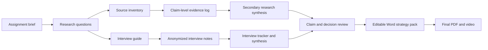

# Documentation and Research Map

**Project:** Airtribe B2B Product Strategy  
**Research cut-off:** 12 September 2026  
**Purpose:** Trace every strategy conclusion to its evidence, expose gaps, and guide the final PDF.

## 1. Current research position

The project has a broad secondary-research base and four anonymized interviews. Two participants work in the proposed mid-market B2B segment: one frontline practitioner and one application-approval stakeholder. The evidence strengthens a working problem hypothesis around complex-escalation context, manual handoff, duplicate work, least-privilege access and reversible pilots. It does not validate the economic buyer, willingness to pay, proposed-product pilot demand or preference for a separate product.

| Control | Current value | Interpretation |
|---|---:|---|
| Registered sources | 65 | Includes 64 external sources and the assignment brief |
| Claim-level public evidence records | 91 | Each record includes a finding, implication, confidence, limitation, and source locator |
| Unique sources referenced by evidence records | 56 | Nine registered sources are not currently linked to an evidence record |
| High or medium-high confidence evidence records | 48 | Stronger records should carry important claims |
| Review and community evidence records | 43 | Useful for workflow discovery; not proof of prevalence or buying demand |
| Customer interviews completed | 4 | Three frontline practitioners and one application-approval stakeholder; two mid-market and two enterprise |

Required wording correction:

> Use “91 evidence records linked to 56 sources, maintained within a 65-source register.” Do not say that all 91 records are linked to 65 sources.

## 2. End-to-end research flow

The flow is controlled by one rule: public sources can establish market direction and generate hypotheses; recent customer workflows are needed to validate the customer, problem priority, buying process, and pilot demand.

## 3. Repository documentation map

| File | Role | Status | Use in final submission |
|---|---|---|---|
| [`../assignment-brief.md`](../assignment-brief.md) | Assignment requirements | Complete | Final compliance check |
| [`source-inventory.csv`](source-inventory.csv) | Source register, access date, strength, and bias | Complete; nine rows are not linked to evidence records | Bibliography and traceability |
| [`review-evidence.csv`](review-evidence.csv) | Claim-level public evidence | 91 records | Evidence behind market, customer, product, and competitor claims |
| [`B2B_AI_Customer_Operations_Evidence.xlsx`](B2B_AI_Customer_Operations_Evidence.xlsx) | Filterable evidence workbook and dashboard | Complete; traceability wording corrected | Internal analysis, not the submission itself |
| [`secondary-research-report.md`](secondary-research-report.md) | Public-research synthesis | Complete; two-interview boundary added | Source for final strategy sections |
| [`competitive-teardowns/README.md`](competitive-teardowns/README.md) | Competitor teardown method and executive result | Complete; public-surface boundary disclosed | Product-strategy evidence appendix |
| [`competitive-teardowns/intercom-fin.md`](competitive-teardowns/intercom-fin.md) | Intercom / Fin teardown | Complete to 12 September 2026 public evidence | Product, pricing, moat, and gap analysis |
| [`competitive-teardowns/zendesk-ai.md`](competitive-teardowns/zendesk-ai.md) | Zendesk AI teardown | Complete to 12 September 2026 public evidence | Product, pricing, moat, and gap analysis |
| [`competitive-teardowns/freshdesk-freddy.md`](competitive-teardowns/freshdesk-freddy.md) | Freshdesk / Freddy AI teardown | Complete with public-pricing discrepancy disclosed | Product, pricing, moat, and gap analysis |
| [`competitive-teardowns/salesforce-service-cloud-agentforce.md`](competitive-teardowns/salesforce-service-cloud-agentforce.md) | Salesforce Service Cloud / Agentforce teardown | Complete to 12 September 2026 public evidence | Product, pricing, moat, and gap analysis |
| [`competitive-teardowns/comparison-and-strategy.md`](competitive-teardowns/comparison-and-strategy.md) | Cross-product decision matrix | Complete; strategic conclusions remain hypotheses | Segment, problem, moat, and land-and-expand decisions |
| [`../interviews/interview-note-template.md`](../interviews/interview-note-template.md) | Recent-workflow interview guide | Complete | Research method appendix or summary |
| [`../interviews/notes/P01.md`](../interviews/notes/P01.md) | Anonymized frontline interview | Complete | Direct workflow and time-loss evidence |
| [`../interviews/notes/P02.md`](../interviews/notes/P02.md) | Anonymized frontline interview | Complete | Direct workflow, audit, and approval evidence |
| [`../interviews/notes/P03.md`](../interviews/notes/P03.md) | Anonymized mid-market application-approval interview | Complete | Permission, pilot, ownership and approval-path evidence |
| [`../interviews/notes/P04.md`](../interviews/notes/P04.md) | Anonymized mid-market frontline interview | Complete | Complex escalation, context transfer and added-system risk |
| [`../interviews/Interview_Research_Tracker.xlsx`](../interviews/Interview_Research_Tracker.xlsx) | Participant and cross-interview synthesis | Research frozen at 4; decision gates not met | Sample description and limitation |
| [`../working/Airtribe_B2B_Product_Strategy_Assessment_Pack.docx`](../working/Airtribe_B2B_Product_Strategy_Assessment_Pack.docx) | Editable final strategy source | Revised and visually inspected | Add video URL, then regenerate PDF |
| [`Airtribe_B2B_Product_Strategy_Assessment_Pack.pdf`](Airtribe_B2B_Product_Strategy_Assessment_Pack.pdf) | Current rendered research pack | Not final submission | Do not submit as the final strategy |
| [`../final/Airtribe_B2B_Product_Strategy_Final.pdf`](../final/Airtribe_B2B_Product_Strategy_Final.pdf) | Final-strategy submission candidate | Visually inspected; video URL pending | Submit only after URL refresh and link check |
| [`../final/VIDEO_SCRIPT.md`](../final/VIDEO_SCRIPT.md) | Under-five-minute narrative | Complete | Record Loom or Drive video |
| [`../PROJECT_STATUS.md`](../PROJECT_STATUS.md) | Delivery tracker | Active | Deadline and readiness control |

## 4. Evidence hierarchy

| Evidence layer | Examples | Appropriate use | Do not use it to claim |
|---|---|---|---|
| Independent and academic research | Gartner surveys, peer-reviewed field study, arXiv and SSRN experiments | Adoption direction, agent-assist outcomes, human-control and evaluation principles | Exact outcomes for the proposed product or segment |
| Market and consulting research | Commercial market estimates and McKinsey maturity research | Category direction, market boundaries, operational maturity | A precise serviceable market without a bottom-up model |
| Vendor surveys and benchmarks | Intercom, Salesforce, Freshworks, Verizon | Scale, usage, adoption, reported barriers | Universal market truth or unbiased competitor comparison |
| Official product, pricing, and documentation | Intercom, Zendesk, Freshdesk, Salesforce | Current capability, packaging, pricing, and documented limitations | Independent product effectiveness |
| Review platforms | G2, TrustRadius, Capterra | Repeated strengths, friction, company-size and role examples | Representative prevalence or causal impact |
| Reddit, Hacker News, and communities | Practitioner and customer discussions | Concrete workflows, workarounds, edge cases, and interview questions | Market size, prevalence, verified outcomes, or willingness to pay |
| Customer interviews | P01–P04 | Recent workflows, systems, delays, workarounds, approval path and consequences | Segment-wide conclusions, confirmed buyer demand or willingness to pay |

## 5. Assignment-question research map

| Assignment question | Main evidence | Current conclusion | Confidence | Gap or limitation |
|---|---|---|---|---|
| Which customer segment should be targeted first? | Review metadata from S25-S27 and S47; P03-P04 | Support-led mid-market B2B technology or technology-enabled services is partially supported | Medium | No support manager, confirmed economic buyer or lower-maturity team |
| How large is the opportunity? | Commercial market estimates S33-S35 | The adjacent category is large, but definitions vary | Low-medium | No bottom-up serviceable-market calculation |
| Is the workflow frequent? | Freshworks benchmarks S07-S08; P01 workload | Support is high-frequency; difficult multi-system cases occur repeatedly for P01 | Medium | Frequency is not measured in the proposed ICP |
| How painful is the problem? | S09, S26-S27, S45, S47-S65; P01-P04 | Fragmented context, duplicate entry, weak handoff and approval friction create time loss and customer delay | Medium | Four interviews; only one leading-workflow case has quantified time impact |
| Why would customers pay? | Pricing sources S13-S16 and public cost discussions | Existing spend confirms a paid category | Low for the proposed product | No buyer interview, budget threshold, or pilot commitment |
| What core problem should be solved? | P01 and P04 plus integration and handoff records; P03 for approval design | Test one permission-aware complex-escalation context and handoff workflow | Medium as a leading hypothesis | Same workflow appears in 2 of 4 interviews, below the threshold of 4 |
| What creates defensibility? | Product sources S17-S20; integration evidence; field studies S11-S12 and S39-S43 | Connector count is not a moat; workflow-specific evaluation, durable write-back, and deployment learning are candidates | Low-medium | No longitudinal product or retention evidence |
| How should the product land? | Agent-assist studies, P03 restricted-pilot evidence and P04 action boundaries | Start with limited queues, least privilege, read-only access and human approval | Medium-high | No proposed-product pilot commitment or quantified acceptance criteria |
| How should the product expand? | Category and workflow logic | Expand from one proven workflow into adjacent variants, systems, and teams | Low | Proposed strategy, not observed customer behavior |
| Who is the buyer? | P03 approval path plus public role patterns | Support Operations is a likely business owner; Head of Support or Customer Operations remains the economic-buyer hypothesis | Low-medium | P03 was not confirmed as the economic buyer and no budget owner was identified |

## 6. Competitor research map

| Competitor | Official sources used | External or customer evidence | What the evidence establishes | Strategic implication |
|---|---|---|---|---|
| Intercom / Fin | S13 pricing; S17 Procedures | S25, S29, S47 and selected community discussions | Outcome pricing, external actions, handoff, simulation, and sequential-processing limits | A new product cannot differentiate on AI chat, actions, or handoff alone |
| Zendesk AI | S14 pricing; S18 AI Agents | S26, S31-S32, S52-S54 and S60 | AI agents, customer context, actions, governance, mature ticketing, and integration pain | Do not replace the helpdesk; prove a narrow workflow advantage |
| Freshdesk / Freddy AI | S07-S09 benchmarks; S15 pricing; S19 integrations | S23, S27 and S38 | Low entry pricing, AI sessions, marketplace breadth, and mixed integration or AI-quality feedback | Connector breadth and low price are insufficient differentiation |
| Salesforce Service Cloud / Agentforce | S06 survey; S16 pricing; S20 guardrails | S22 and S46; S28 remains registered but unlinked | Multiple buying models, CRM context, data grounding, guardrails, and large installed capability | Competing directly on unified CRM context is weak; cross-vendor workflow quality must be proven |

Competitor conclusion:

> Intercom, Zendesk, Freshdesk, and Salesforce already provide AI assistance, automation, integrations, knowledge, and governance capabilities. The open opportunity is not generic integration. It is a specific workflow where deployment, context completeness, write-back reliability, control, or economics remain materially better than incumbent alternatives.

## 7. Interview evidence map

| Participant | Sample attributes | Recent workflow | Direct evidence | What it supports | What it does not support |
|---|---|---|---|---|---|
| P01 | Frontline; outsourced B2B support; enterprise 10,000+; process team about 80 | Closed-but-unresolved case requiring CRM reconstruction and second-line escalation | 20-25 minutes per difficult case; 5-6 difficult cases daily; Teams response not written back; separate Excel tracker | Context-search burden, missing handoff history, and manual status work | Mid-market fit, buying demand, or pilot interest |
| P02 | Frontline; retail banking and cards; enterprise 10,000+; operations unit 200+ | KYC-related complaint requiring CRM, document, risk, and compliance checks | About 15 minutes of duplicate logging per case; 4-6-hour approval wait; manual email upload; duplicate cases | Audit-versus-speed tension, repeated entry, approval delay, and permission constraints | General B2B prevalence, buyer demand, or safe autonomous action |
| P03 | Application-approval stakeholder; B2B SaaS or tech-enabled services; about 400 employees | Review and restricted pilot of an AI Zendesk analytics integration | One-month pilot; two queues; write-back disabled; Support Ops, admin, security, procurement and legal involved | Least privilege, named ownership, limited pilots, system-owner approval and reversible write-back | Economic buyer, proposed-product interest or quantified value |
| P04 | Frontline; mid-market B2B SaaS or tech-enabled services | Product issue escalated from Zendesk to engineering through Jira | Manual Zendesk-to-Jira reconstruction; repeat diagnostic request; repeated status work; no duration supplied | Complex-escalation context and handoff; ordinary Zendesk ticketing is sufficient | Workflow prevalence, quantified cost, buyer or pilot commitment |

Interview-diversity assessment:

| Dimension | Coverage | Status |
|---|---|---|
| Industry | Outsourced B2B support, banking operations, and B2B SaaS or technology-enabled services | Improved but exact sectors for P03-P04 are not disclosed |
| Company size | Two enterprise and two mid-market participants | Partial diversity achieved |
| Customer-support maturity | All four use established, multi-system support operations | Lower-maturity environment remains missing |
| Role | Three frontline practitioners and one application-approval stakeholder | Improved; no support manager or economic buyer |
| Technology environment | Different helpdesk and workflow combinations | Partial |
| Buyer perspective | P03 described the approval path but was not the confirmed economic buyer | Partial; budget ownership remains missing |

Required disclosure:

> Primary research included four anonymized participants: three frontline practitioners and one non-executive application-approval stakeholder. Two worked in large enterprises and two represented mid-market B2B SaaS or technology-enabled services. The sample improves company-size, role, and technology coverage but does not include a support manager, confirmed economic buyer, lower-maturity support team, proposed-product pilot commitment, or willingness-to-pay evidence. Findings are exploratory and do not establish prevalence or a validated ICP.

## 8. Claim-to-evidence control

| Proposed final claim | Evidence status | Safe wording |
|---|---|---|
| Customer support is a large, active software category | Directionally supported | Market estimates show a large adjacent category, but definitions and estimates vary |
| AI adoption in customer service is increasing | Directionally supported | Multiple surveys report rising adoption, while mature deployment and data readiness remain limited |
| Frontline practitioners are a relevant user | Observed in P01, P02 and P04 and supported by agent-assist studies | Three interviews identify frontline practitioners as users; P04 directly represents the mid-market segment |
| Customer context and handoffs are fragmented | Observed in P01, P02 and P04; directionally corroborated online | P01 and P04 independently described manual complex-escalation context transfer; P02 showed audit-state fragmentation |
| Mid-market B2B is the best initial segment | Partially supported by P03-P04 | Mid-market B2B is the leading sampling segment, not a validated ICP |
| A unified context layer is differentiated | Contradicted as a generic claim | Incumbents already provide context and integrations; differentiation must be workflow-specific |
| A separate product will be adopted | Unknown | Test whether customers prefer a separate layer over native helpdesk capabilities |
| Companies will pay the proposed price | Unknown | Existing category pricing shows budget exists, but willingness to pay for this product was not tested |
| Read-only agent assist is the safest entry | Supported by P03-P04 and secondary evidence | Start with limited scope, least privilege and human approval; P03's prior pilot disabled write-back |
| Workflow evaluation and durable write-back can become a moat | Hypothesis | Treat evaluation data, deployment learning, and integration reliability as candidate moats to validate |

## 9. Policy-document position

The current register does not contain a substantive government or cross-industry AI-policy source. S37 documents review-platform quality policy; it is useful for assessing review bias, not for governing an AI customer-support product.

Policy sources are optional unless the final strategy makes legal, regulatory, privacy, or regulated-industry claims. If added, use them only to support product requirements such as data minimization, least-privilege access, auditability, human oversight, retention, and incident management.

Candidate policy families, to be verified for the selected geography and use case before citation:

- AI risk-management framework.
- Applicable privacy and data-protection law.
- Sector-specific rules only if banking, healthcare, payments, or another regulated industry becomes the target.

Do not use policy documents to prove customer pain, market size, workflow frequency, or willingness to pay.

## 10. Final-document construction map

| Final PDF section | Evidence to use | Required caveat |
|---|---|---|
| Executive recommendation | Working customer, job, problem, and first test | Call it a hypothesis, not a validated strategy |
| Market opportunity | S33-S35, S07-S08, S02, S05-S06, S45-S46 | Category definitions vary; vendor surveys are biased |
| Customer and problem | P01-P04 plus selected review and community evidence | Four-person sample; public anecdotes and interviews do not prove prevalence |
| Competitor analysis | S13-S20 plus review evidence | Vendor pages are claims; incumbents already cover core capabilities |
| Product strategy | One workflow, assist-first boundary, metric, and rejection criteria | Exact workflow and pilot demand remain unproven |
| Moat | Evaluation data, integration durability, controlled deployment learning | Candidate moat, not an existing asset |
| Land and expand | One helpdesk, one system of record, one workflow | Buyer and expansion triggers are hypotheses |
| Risks and unknowns | Sample bias, data access, incumbent response, economics, adoption | Make unknowns explicit |
| Research limitations | Interview diversity and source-bias disclosure | Do not hide the 4-of-8 interview shortfall |
| References | Only sources actually used in final claims | Use current access dates and correct source count |

## 11. Research and submission gates

| Gate | Current result | Final treatment |
|---|---|---|
| Four participants independently mention the same workflow | Not met; observed 2 | Treat complex-escalation context/handoff as the leading hypothesis, not a validated workflow |
| Three participants report measurable impact for the leading workflow | Not met; observed 1 | Use P01's participant-reported time only as case evidence |
| Three participants say native tools are insufficient for the leading workflow | Not met; observed 2 | Preserve P04's counterpoint that Zendesk is sufficient for ordinary tickets |
| Two participants show strong proposed-product pilot interest | Not met; observed 0 | P03's previous restricted pilot is approval evidence, not demand for this product |
| Source records have a locator and limitation | Met | Preserve citations and bias notes |
| Competitors have official and customer evidence | Met | Show capability and counter-evidence together |
| Interview diversity across size and maturity | Not met | Include the required disclosure |
| Final PDF is visually verified | Met | Preserve after the video-link refresh |
| Video link works | Pending | Record, paste, regenerate and test before submission |

## 12. Immediate documentation actions

1. Record the under-five-minute video using `final/VIDEO_SCRIPT.md`.
2. Paste the working Loom or Google Drive URL into the Video link section on PDF page 12 of the editable Word strategy.
3. Regenerate the final PDF and visually recheck page 12.
4. Open the video link in a private browser window.
5. Upload the refreshed PDF only; preserve the evidence boundary and 4-of-8 limitation.
