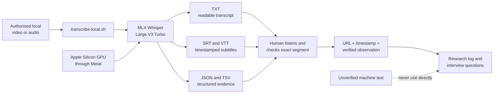

# Local Video-to-Text Workflow

**Status:** Installed and technically verified on 16 September 2026

**Runtime:** Project-local Python 3.12 environment with `mlx-whisper` 0.4.3

**Recommended model:** `mlx-community/whisper-large-v3-turbo`

## Purpose

This workflow converts an authorised local video or audio file into provisional text, subtitle, timestamp, and JSON files. It does not download media from YouTube and it does not turn a machine transcript into verified research evidence.

## Visual KT — how the workflow works



The model converts speech into candidate text. The researcher—not the model—decides whether a sentence is accurate and relevant enough to use.

## What was installed

```text
Uber Find My Ride project
├── scripts/transcribe-local.sh        Reusable command tracked in Git
├── research/local-transcription-workflow.md
│                                      Method and evidence rules tracked in Git
└── .local-transcription/              Private local folder ignored by Git
    ├── venv/                           Python and MLX Whisper runtime
    ├── hf-cache/                       downloaded Whisper models
    ├── input/                          authorised source media
    └── output/                         provisional transcripts and subtitles
```

## Why this option

- MLX uses the Mac's Apple Silicon GPU locally.
- The multilingual Whisper model supports English, Hindi, and Telugu.
- Media and transcripts remain on the Mac.
- There is no per-minute transcription charge after the one-time model download.

## Current verification

A 5.6-second locally generated English sample was transcribed with both the tiny setup-check model and the recommended Large V3 Turbo model. Large V3 Turbo reproduced both test sentences correctly and produced TXT, VTT, SRT, TSV, and JSON outputs with word timestamps.

This confirms that the software and Metal acceleration work. It does **not** establish accuracy or speed for real Hyderabad videos, noisy audio, accents, or mixed-language speech.

## Required input

Place only media that the researcher owns or is authorised to process in:

```text
.local-transcription/input/
```

The complete `.local-transcription/` directory is ignored by Git so that media, model files, and provisional transcripts are not published accidentally.

## Run a transcription

From the project folder:

```bash
./scripts/transcribe-local.sh .local-transcription/input/example.mp4
```

For a video that is mainly Telugu or Hindi, an explicit language can improve consistency:

```bash
./scripts/transcribe-local.sh .local-transcription/input/example.mp4 te
./scripts/transcribe-local.sh .local-transcription/input/example.mp4 hi
```

Leave the language argument out for genuinely code-mixed speech. Output files are written under `.local-transcription/output/`.

## Evidence rule

Treat every generated transcript as provisional. Before using an excerpt:

1. watch the relevant video segment;
2. compare the words against the audio;
3. record the video URL and timestamp;
4. label unclear words rather than guessing; and
5. keep the source as Grade C secondary evidence, not as an interview.

## Research scope

Do not transcribe all 753 collected videos. First use the existing visual-review process to establish relevance. The next useful pilot is one authorised local copy from the five-video review batch: YV0006, YV0008, YV0004, YV0012, or YV0020.

## Remaining blocker

No authorised video or audio file is currently present in the project. The real-video pilot can begin when one is placed in `.local-transcription/input/`.

## Final KT checklist

After the first real-video pilot, the handover will include:

1. a live run of one video from input to transcript;
2. a plain-language explanation of each command and folder;
3. a comparison of the audio against the generated timestamps;
4. measured processing time, model storage, and observed errors;
5. the rule for converting a provisional transcript into a verified research note; and
6. a repeatable command the researcher can run independently.
