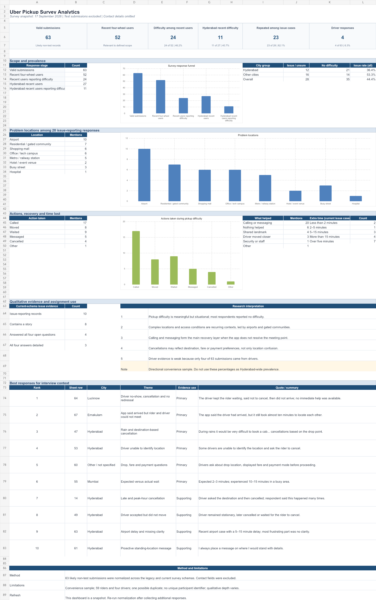

# Survey Insight Synthesis

**Status:** Evidence-traceable draft for assignment review

**Snapshot:** 17 September 2026

**Scope:** Four-wheel app-cab pickups, with Hyderabad as the primary city and other Indian cities used as comparison evidence

## Recommendation

Treat pickup coordination as a meaningful but situational reliability problem. The evidence does not support redesigning every pickup. It supports focusing further analysis on complex locations and journeys where the rider or driver cannot translate the app state into a clear, accessible real-world meeting point.

Do not present the percentages below as Hyderabad-wide prevalence. They describe a convenience sample of survey respondents.

## Evidence base

| Measure | Result |
|---|---:|
| Unique non-test submissions | 62 |
| Riders | 58 |
| Drivers | 4 |
| Recent four-wheel users | 51 |
| Recent users reporting difficulty or uncertainty | 24 of 51, or 47.1% |
| Recent Hyderabad four-wheel users | 27 |
| Recent Hyderabad users reporting difficulty or uncertainty | 11 of 27, or 40.7% |
| Total issue or uncertainty cases | 28 |
| Issue cases reported as repeated | 23 of 28, or 82.1% |
| Current-schema issue records with fuller structured evidence | 10 |

**Primary source:** [`../data/survey/normalized-data.tsv`](../data/survey/normalized-data.tsv)

**Analysis workbook:** [`../data/survey/uber-pickup-survey-analytics.xlsx`](../data/survey/uber-pickup-survey-analytics.xlsx)

## 1. Research Goal

Understand when and why post-booking four-wheel pickups become difficult, how riders and drivers recover today, and which failures most reduce pickup reliability.

The candidate outcome metric is:

> Pickups completed without avoidable calls, location changes, extended waiting, or cancellation.

This is a proposed measurement direction, not a confirmed Uber metric.

## 1.1 Key Interview Questions

1. Tell me about the last time you had difficulty finding your ride after booking it.
2. Where were you, and what did the app tell you?
3. When did you first realize the pickup might not work as expected?
4. What made the rider and driver difficult to locate or identify?
5. What did you do next: call, message, move, wait, cancel, or seek help?
6. How much extra time or effort did the situation require?
7. What finally helped, if anything?
8. Has the same problem happened at other locations?
9. What information or support was missing at the most frustrating moment?
10. For drivers: what prevented you from reaching the pin or identifying the rider?

The live form asked these questions asynchronously. The four narrative prompts were optional in the interface, and the form could not ask follow-up questions when an answer was vague. These are survey responses, not synchronous interviews.

## 2. Top 10 Most Relevant Insights

### Insight 1 — Pickup difficulty is meaningful, but it is not universal

**What the evidence shows**

- 24 of 51 recent four-wheel users reported difficulty or uncertainty.
- 11 of 27 recent Hyderabad four-wheel users reported difficulty or uncertainty.
- 34 of all 62 unique records did not report a pickup issue.

**Direct quote**

> “On the whole the experience is good. Exceptions will always be there.” — R030, rider

**Interpretation**

The opportunity is not to add more steps to every pickup. The team should first identify the locations and conditions where coordination risk is high.

**Evidence strength:** Strong directional sample evidence. The sample is not representative of Hyderabad.

### Insight 2 — For affected respondents, the problem is usually recurring

**What the evidence shows**

- 23 of 28 issue cases said the problem had happened before.
- Repetition appeared across Hyderabad and comparison cities.

**Direct quote**

> “During rains it would be very difficult to book a cab and even after booking there are many cancellations based on the drop point.” — R047, Hyderabad rider

**Interpretation**

Pickup difficulty is not only a rare first-time mistake for the affected group. Weather, time, destination, and location conditions can repeatedly recreate the problem.

**Evidence strength:** Strong within the issue-reporting subgroup.

### Insight 3 — Complex environments concentrate pickup problems

**What the evidence shows**

Issue respondents selected multiple locations, so mentions exceed the number of people:

| Location | Mentions |
|---|---:|
| Airport | 10 |
| Residential or gated community | 7 |
| Shopping mall | 6 |
| Office or technology campus | 6 |
| Metro or railway station | 5 |
| Busy street | 3 |
| Hotel or event venue | 2 |
| Hospital | 1 |

**Direct quote**

> “No clarity” — R063, Hyderabad rider describing an airport pickup

**Interpretation**

Large or controlled locations create a translation problem between the map pin and the physical place: gate, side, road, level, access rule, or stopping point.

**Evidence strength:** Strong location pattern, but not a location-level prevalence estimate.

### Insight 4 — “Driver arrived” does not mean the rider and driver can meet

**What the evidence shows**

- Similar gates were selected in three current-schema issue cases.
- Wrong-pin conditions were selected in four cases.
- R067 describes the driver moving around a road junction while the app showed an arrived state.

**Direct quote**

> “The aap says he has arrived, but almost 10 minutes to locate each other” — R067, Ernakulam rider

**Interpretation**

The app can be technically correct at area level while failing at the last physical step. The missing information is often the exact side, landmark, accessible route, or stopping position.

**Evidence strength:** Moderate. The clearest support comes from a small number of detailed records.

### Insight 5 — Calling and messaging are the main recovery layer

**What the evidence shows**

- Calling was selected in 17 issue cases.
- Messaging was selected in five issue cases.
- Calling or messaging was marked as helpful in 20 issue cases.
- A landmark was marked as helpful in four cases.

**Direct quote**

> “We talked to each other” — R063, Hyderabad rider

> “Driver calls and asks for drop location.” — R047, Hyderabad rider

**Interpretation**

The app frequently hands the final coordination job back to the rider and driver. Communication works, but it adds effort and can expose a separate cancellation decision.

**Evidence strength:** Strong behavioral pattern in the sample.

### Insight 6 — The rider often absorbs the recovery effort

**What the evidence shows**

- Nine issue respondents waited.
- Eight moved from their initial position.
- Only three said the driver moving closer helped.
- Only one selected staff or security as helpful.

**Direct quote**

> “I thought he will come but he kept on keeping me waiting” — R064, Lucknow rider

> “12th sept evening around 5.15pm from palarivattom to Elamakkara it took more than 10 minutes to capture the attn of driver , even though he was passing up snd down on cross road junction.” — R067, Ernakulam rider

**Interpretation**

Recovery is not just a communication cost. Riders may have to move, wait, or monitor the vehicle even when they do not know which movement will solve the problem.

**Evidence strength:** Moderate to strong within issue cases.

### Insight 7 — Pickup failures can create material delay

**What the evidence shows**

Only ten current-schema issue records captured a time range:

| Additional time | Cases |
|---|---:|
| Less than 2 minutes | 2 |
| 2–5 minutes | 1 |
| 5–15 minutes | 3 |
| More than 15 minutes | 4 |

Seven of these ten reported more than five extra minutes.

**Direct quote**

> “At times it takes unusually long time and we book uber under normal belief that the ride will be available within 2-3 minutes but at times it takes 10-15 minutes” — R055, Mumbai rider

**Interpretation**

The reliability gap is partly an expectation gap. An ETA or arrived state can create confidence that is not matched by the real pickup time.

**Evidence strength:** Moderate. The time question is available for only ten issue records.

### Insight 8 — Cancellation is related to pickup coordination, but not always caused by location confusion

**What the evidence shows**

- Cancellation was coded as what happened in five current-schema issue cases.
- Four issue respondents selected cancellation as an action.
- Detailed records mention destination, displayed fare, payment mode, rain, and slow approach as well as location.

**Direct quote**

> “Driver calls and asks for drop location. Then based on the location he cancels” — R047, Hyderabad rider

> “Every time they asking about drop location how much amount shows in app and your payment mode cash or Uber cash” — R060, rider

**Interpretation**

The team should not label every cancellation as a map or pickup-point failure. Pickup coordination, destination preference, fare, payment mode, and driver behavior can overlap in the same journey.

**Evidence strength:** Moderate. The records show overlap but cannot isolate causal weight.

### Insight 9 — Some respondents found no effective recovery or support

**What the evidence shows**

- Six issue respondents selected “nothing helped.”
- R045 reported a wrong pin, inability to stop, cancellation, more than 15 minutes of delay, and no effective help.
- R064 described a driver no-show followed by cancellation.

**Direct quote**

> “No one to seek redressal or help” — R064, Lucknow rider

> “Uber or Ola have no control over drivers. Grievance redressal has to b immediate” — R064, Lucknow rider

**Interpretation**

When communication fails, the current journey may not offer a clear recovery path. The unmet need is not only better location information; it may also include timely escalation and clarity about what happens next.

**Evidence strength:** Moderate, supported by six structured selections and one detailed account.

### Insight 10 — Finding the ride includes vehicle identification, not only reaching the pin

**What the evidence shows**

- One respondent reported a mismatch between the vehicle number in the app and the vehicle carrying the rider.
- Other issue records described similar gates and wrong pins, showing that physical proximity alone does not confirm the correct match.

**Direct quote**

> “The number of the vehicle mentioned in the app is different from the vehicle carrying us.” — R018, Visakhapatnam rider

**Interpretation**

The pickup job ends only when the rider and driver confidently identify each other and the correct vehicle. This response is an important safety-related edge case, but it should not be presented as a common pattern.

**Evidence strength:** Weak edge-case evidence. It needs validation before influencing a broad product direction.

## Contradictions and exceptions

| Evidence tension | What it means |
|---|---|
| 24 of 51 recent users reported difficulty, while most total respondents did not | The problem is important for a segment, not universal |
| Calling or messaging helped 20 issue cases, but six said nothing helped | Communication often recovers the pickup, but it is not a complete safety net |
| Airports led location mentions, but residential, mall, office, station, and street cases also appeared | The opportunity may be a reusable coordination model with location-specific rules, not an airport-only solution |
| Cancellation appeared with wrong pins and access problems, but also with destination, fare, and payment questions | Cancellation cannot be attributed to one root cause from this dataset |
| Detailed rider evidence exists, but driver evidence is thin | Two-sided product decisions remain premature |

## Evidence limitations

1. This is a convenience sample recruited through the researcher's network and distribution channels.
2. Only four of 62 unique submissions came from drivers; only one driver reported difficulty or uncertainty.
3. The early survey schema captured structured selections but not all four open-text answers. Only ten current-schema issue records contain fuller cause, time, and recovery evidence.
4. The self-serve form could not probe unclear or contradictory answers.
5. Participant-specific photos, videos, or message screenshots are incomplete.
6. One confirmed duplicate was removed, and the dataset has no durable anonymous participant identifier.
7. Multi-select questions produce mention counts, not mutually exclusive people counts.
8. Quotes are stored anonymously by response ID. Attribution requires separate explicit permission.

## Addendum — closeout cross-tabs and corrections (17 September 2026)

Computed directly from [`../data/survey/normalized-data.tsv`](../data/survey/normalized-data.tsv) with a script, not by hand, to avoid transcription error.

**Duplicate correction:** R031 and R032 are a confirmed duplicate — identical paragraph, same city, submitted 9 seconds apart. R032 is excluded from the final evidence workbook. Neither reported an issue, so the issue-case insights remain unchanged.

**Location × delay length (10 time-tagged issue records):** long delays (>15 min, 4 records) and shorter delays (6 records) mention airport and residential at roughly the same rate in both groups. No location type stands out as distinctly slower to resolve in this sample — a genuine null result, not a gap in the analysis.

**Repeated × location (28 issue records, 23 repeated / 5 not):** airport, residential, and office lead mentions among repeat cases, but the non-repeat group is only 5 records — too small to say repetition concentrates anywhere specific. This mostly re-confirms Insight 3's overall location ranking rather than adding a new pattern.

**Language coverage:** 60 English, 3 Telugu, **0 Hindi** — despite a Hindi WhatsApp message going out. Worth noting as a distribution gap if more responses are still being collected; not enough Telugu volume (3) to compare answer depth by language.

**New themes outside the pre-built answer chips**, from open-text scanning:

- **Vehicle hygiene/condition** (3 respondents: dirty vehicle, no water bottle, no fire extinguisher, driver on phone while driving) — recurring but outside this project's pickup-coordination scope. Worth a one-line mention as an adjacent, unaddressed complaint category, not a pickup-difficulty finding.
- **Price-driven substitution to Rapido** (R034: "Prices are high. So preferring rapido most of the time") — relevant to the desk research's competitor/alternatives section (Track A), not previously cross-referenced there.
- **A rider-invented workaround**: R061 pre-emptively messages the driver exact pickup details before the driver arrives, unprompted by the app. This is the strongest piece of evidence yet for the strategy direction in [`02-strategy-implications.md`](02-strategy-implications.md) — a real user already manually doing the thing that direction proposes making easier.

The final submission counts and denominators above include this correction; the insight meanings and evidence-strength ratings are unchanged.

## What this synthesis supports next

This evidence is sufficient to move to two activities:

1. close the market-research section using the existing desk evidence and explicit data gaps; and
2. derive strategy directions from Insights 3–9 while treating Insight 10 as an edge case and the driver perspective as an open research gap.

It is not yet sufficient to claim a validated solution, Hyderabad-wide prevalence, or a complete two-sided rider-and-driver model.
